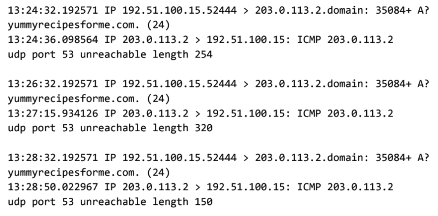

# Network Traffic Analysis: DNS Service Interruption

An educational incident analysis completed as part of the Google Cybersecurity Certificate. I reviewed a supplied tcpdump log to investigate why users could not access a fictional client website.

## Report

[Read the incident report (PDF)](network-traffic-analysis-report.pdf)

## Supporting evidence

Supplied tcpdump log from the Google Cybersecurity Certificate coursework scenario, analysed in the accompanying report.

## Findings

- DNS requests were sent over UDP to 203.0.113.2 on port 53.
- ICMP replies reported “udp port 53 unreachable,” indicating that the DNS service was unreachable.
- The captured traffic begins at 13:24:32 and shows repeated failures.
- Possible causes include an unavailable DNS service or a firewall configuration issue. A denial-of-service attack is a possibility to investigate, not a confirmed finding.

## Skills demonstrated

- Interpreting supplied tcpdump output and distinguishing DNS, UDP and ICMP
- Identifying source and destination addresses, ports and timestamps
- Separating observed evidence from suspected causes
- Documenting an incident and proposing troubleshooting steps

## Recommended next steps

Check the DNS service and firewall configuration, then review server logs and traffic volumes to determine the cause and restore service. These are proposed actions; this exercise did not include implementing or verifying remediation.

This is a simulated coursework scenario, not an investigation of a live organisation.
